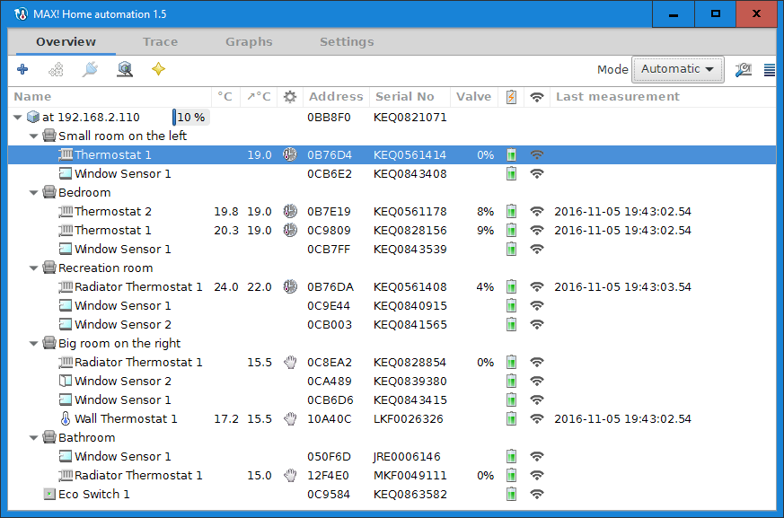

<H2>MAX! Home Automation</H2>

MAX! home automation is a GTK+ application to manage ELV/eQ-3 MAX! cubes. A cube is a gateway to a network of radiator thermostats, shutter contacts etc. The application provides:

<ul>
<li>Access and control over HTTP rest API;</li>
<li>Access and control over an integrated MQTT broker;</li>
<li>Python scripting support;</li>
<li>Data logger backed by a database, most commonly databases are supported over ODBC;</li>
<li>Set and is temperatures graphs;</li>
<li>E-mail notifications of the low battery status.</li>
</ul>

